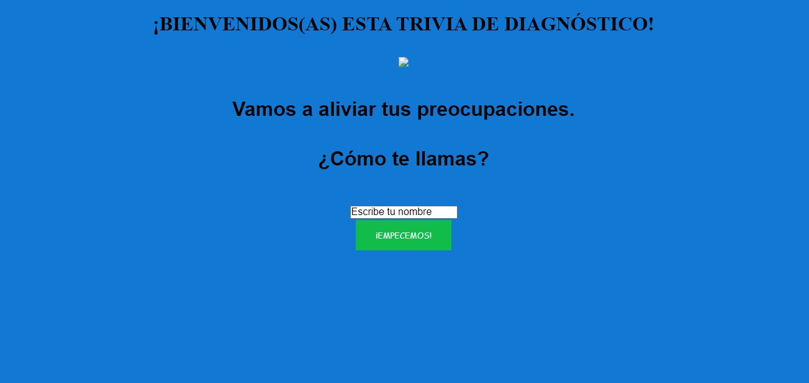
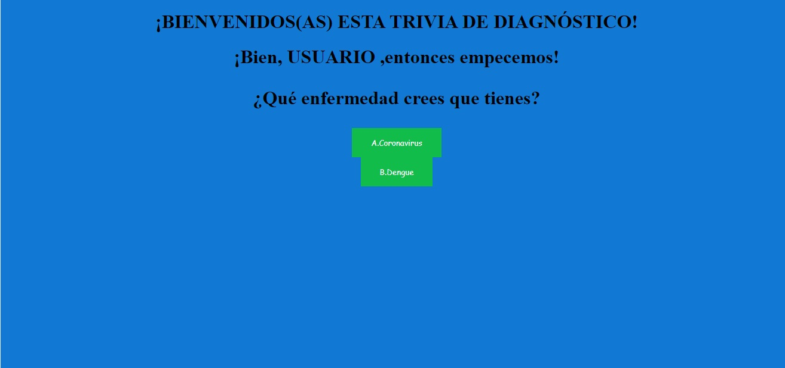
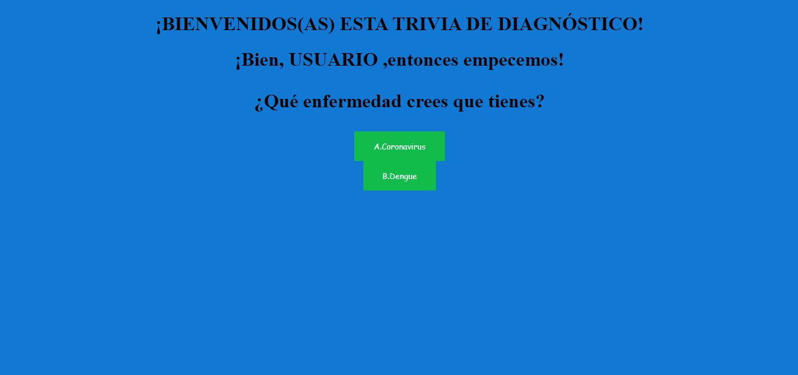
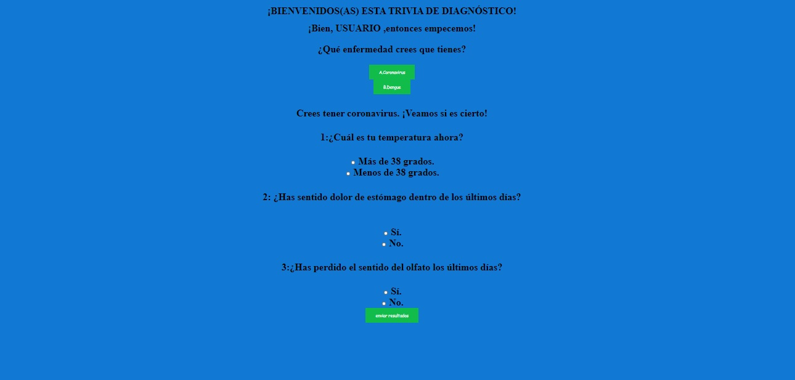
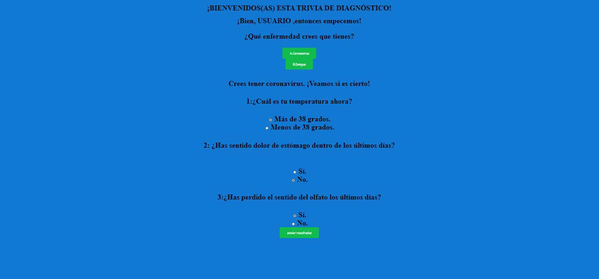

### 1.1-Dupla-3-Preadmision-LMS

## PROYECTO "TRIVIA"

### Prueba de diagnóstico  

<https://repl.it/@AnaGuanda/InfiniteProbableParameter>

Nuestra trivia tiene la forma de una prueba rápida de diagóstico donde nuestro usuario podrá identificar si es que tiene algunas de las dos enfermedades más comunes actualmente: coronavirus y dengue.

## Adjuntamos algunas fotos de nuestro proceso.

# 1. Primeros bocetos

# 2. Nuestros primeros avances codeando.

# 3. Acercándonos al final.

# 4. ¡Listo!

