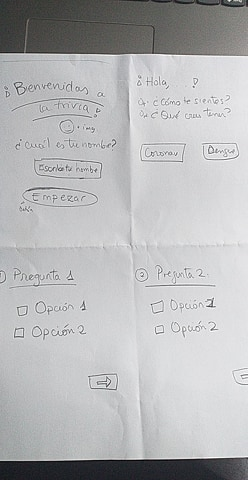
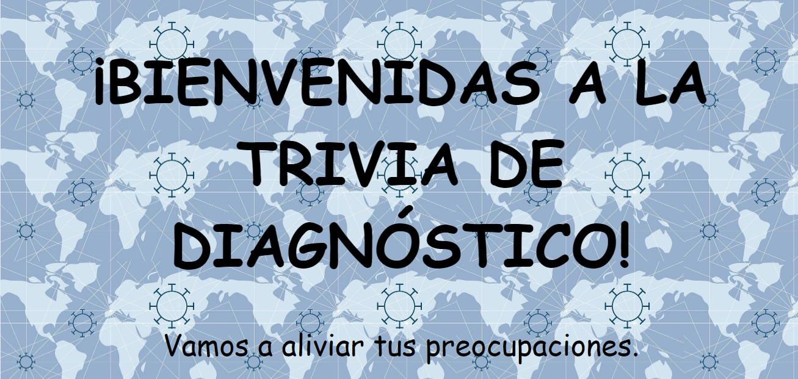
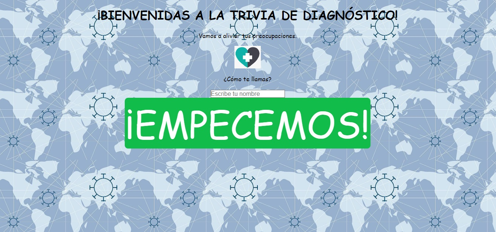

### 1.1: Trío - Preadmisión

## PROYECTO TRIVIA: Prueba de diagnóstico

<https://repl.it/@AnaGuanda/DapperChiefLeads>
 
 
Nuestra trivia tiene la forma de una prueba rápida de diagóstico donde orientamos a nuestro usuario en identificar la probabilidad de tener algunas de las dos enfermedades más comunes actualmente: coronavirus y dengue. Ya que estas, debido a la exposición mediática son más conocidas, y nuestro usuario puede tener dudas acerca de sus síntomas. Con 3 simples preguntas es que logramos darle una idea acerca de las probabilidades y le recomendamos visitar a un centro de salud en caso de dar positivo.

## Adjuntamos algunas fotos de nuestro proceso. Aunque no logramos terminar con lo que planteábamos al inicio, aprendimos muchísimo en el proceso.

# 1. Primeros bocetos

# 2. Testeamos y realizamos cambios

# 3. Nuestros primeros avances codeando en Javascript.

# 4. Ensayo y error.

# 5. Acercándonos al final.

