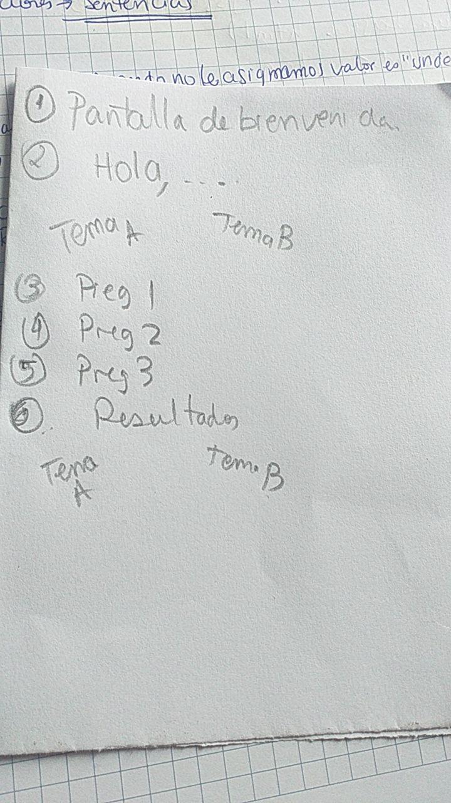
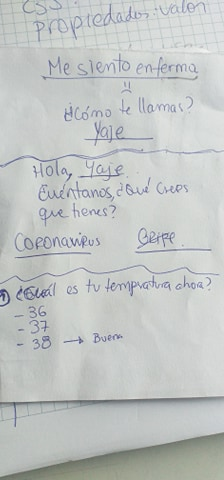
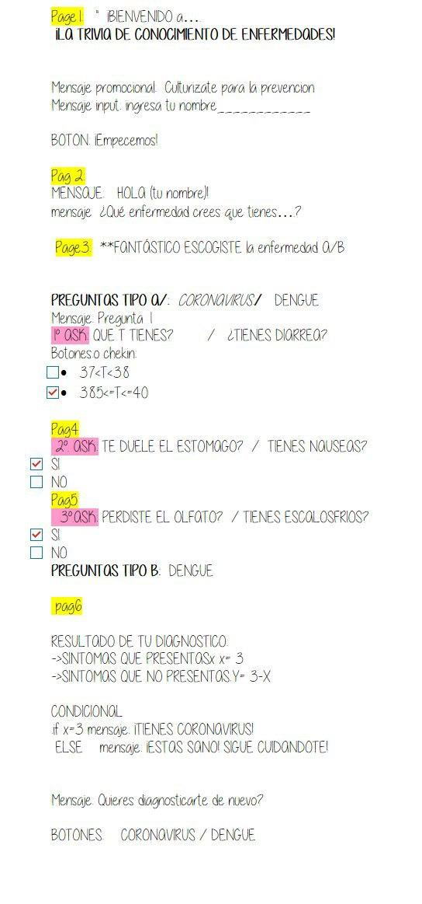
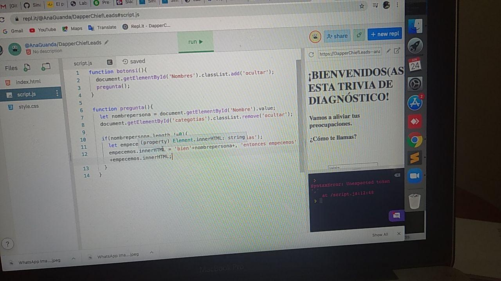

### 1.1: Trío - Preadmisión

## PROYECTO TRIVIA: Prueba de diagnóstico

<https://repl.it/@AnaGuanda/DapperChiefLeads>

Nuestra trivia tiene la forma de una prueba rápida de diagóstico donde nuestro usuario podrá identificar si es que tiene algunas de las dos enfermedades más comunes actualmente: coronavirus y dengue.

## Adjuntamos algunas fotos de nuestro proceso. Aunque no logramos terminar con lo que planteábamos al inicio, aprendimos muchísimo en el proceso. Esperamos terminar de todas maneras nuestra trivia!

# 1. Primeros bocetos

# 2. Testeamos y realizamos cambios

# 3. Nuestros primeros avances codeando en Javascript.

# 4. Ensayo y error.

# 5. Acercándonos al final.

